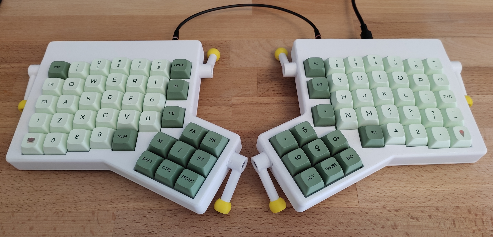

# Ergodox Case (1u - 80 key)

### Parts to assemble both sides:

| Count | Part             | Notes                        |
|:-----:|:----------------:|:----------------------------:|
| 2     | bottom           | 1 with usb, 1 without usb    |
| 2     | top              | 1 with usb, 1 without usb    |
| 2     | plates           |                              |
| 6     | legs             |                              |
| 6     | feet             |                              |
| 18    | M3 inserts       |                              |
| 6     | M3 nuts          |                              |
| 12    | 10mm M3 screws   | for attaching bottom to top  |
| 6     | 16mm M3 screws   | for attaching legs to bottom |
| 6     | 4mm M3 screws    | for attaching feet to legs   |

### Notes

* The case only supports 1u outer row. 
* Currently, the plate only support 1u thumb cluster keys, but the plate may be easily adapted to support 2u keys.
* Only one stl is provided for each part. Mirror the parts depending on your setup.
* Plates with and without supports are provided. The version without supports is mainly meant for cutting out from acrylic etc.
* Use as small and narrow M3 inserts as possible, some of the wider ones may not fit.
* Use countersunk screws.
* Feet should be printed in TPU or any other soft filament (for better grip).
* The case supports PCB thickness of about 1.55-1.65 mm.
* This case is not made to print fast or save filament, it's thick, robust, and strong.

